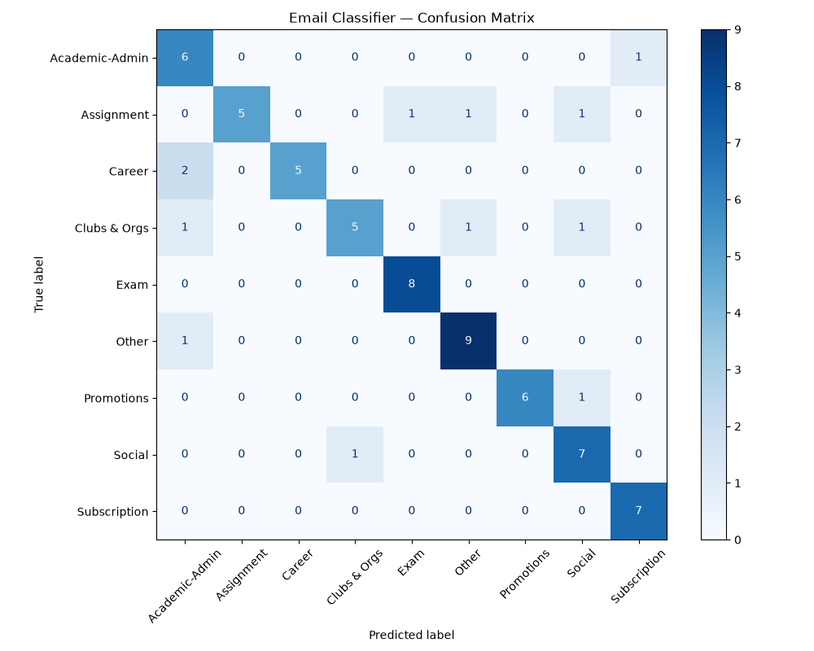

# MailWeave

A Chrome extension that classifies Gmail emails in real time and automatically builds a deadline checklist. When you open an email, MailWeave extracts its subject and body, sends it to a FastAPI backend, and displays a color-coded category badge inside Gmail — while any detected deadline gets added to a persistent, editable to-do list in the extension popup.

---

## How It Works

```
Gmail (browser)
  └── content.js          watches for email navigation, extracts subject/body
        └── background.js forwards data to local API server (bypasses CORS)
              └── FastAPI (localhost:8000)
                    ├── Classifier: TF-IDF + Logistic Regression → category, confidence
                    └── Deadline Extractor: spaCy NER + regex fallback → deadline
                          └── response → badge in Gmail + task added to checklist
```

The checklist lives in `chrome.storage.local`, so viewing, checking off, editing, and manually adding tasks all work without the backend running. Only classifying **new** emails requires the local server to be active.

---

## Categories

9 categories, tuned for a student inbox:

| Category | Badge Color |
|---|---|
| Assignment | Blue |
| Exam | Yellow |
| Clubs & Orgs | Teal |
| Social | Green |
| Career | Orange |
| Academic-Admin | Indigo |
| Subscription | Red |
| Promotions | Purple |
| Other | Grey |

---

## Project Structure

```
mail-weave/
├── extension/
│   ├── manifest.json
│   ├── content.js             # reads Gmail emails, adds badges, saves checklist items
│   ├── background.js          # service worker, relays requests to FastAPI
│   ├── popup.html / popup.js  # checklist UI: checkboxes, manual add, sorting
│   └── icons/
│
└── backend/
    └── app/
        ├── main.py             # FastAPI: /classify, /test
        └── ml/
            ├── classifier.py          # loads model, runs inference
            ├── deadline_extractor.py  # spaCy NER + regex fallback for dates/times
            ├── train.py               # trains + saves model
            ├── evaluate.py            # confusion matrix, error analysis, feature importance
            ├── data/           # email_training_data.csv (not committed, see below)
            ├── models/         # generated .pkl files (not committed, see below)
            └── outputs/        # confusion_matrix.png
```

**Note on data/models:** the training CSV and trained `.pkl` files are intentionally not committed to this repo. Run `train.py` with your own labeled data (same `text,label` CSV format) to generate them locally.

---

## Setup

### Prerequisites
- Python 3.8+
- Google Chrome

### 1. Backend

```bash
cd backend
pip install fastapi uvicorn scikit-learn joblib pandas matplotlib spacy
python -m spacy download en_core_web_sm
```

Place a CSV at `backend/app/ml/data/email_training_data.csv` with columns `text,label`, then:

```bash
cd backend/app/ml
python train.py
```

This generates `models/email_classifier_model.pkl` and `models/tfidf_vectorizer.pkl`.

Start the API server:

```bash
cd backend
uvicorn app.main:app --reload
```

Verify:
```
GET http://localhost:8000/test
→ {"message": "works!"}
```

### 2. Chrome Extension

1. Go to `chrome://extensions`
2. Enable **Developer mode**
3. Click **Load unpacked**, select the `extension/` folder
4. The MailWeave icon appears in the toolbar

---

## Usage

1. Make sure the FastAPI server is running
2. Open Gmail, click any email — MailWeave classifies it and shows a badge
3. If a deadline is detected, the task is automatically added to your checklist
4. Click the MailWeave toolbar icon to view, check off, edit, or manually add checklist tasks — this works even if the backend is offline

---

## API Reference

### `POST /classify`

**Request:**
```json
{
  "subject": "CS161 Homework 3 due Friday",
  "snippet": "Please submit before 11:59 PM"
}
```

**Response:**
```json
{
  "category": "Assignment",
  "confidence": 0.87,
  "deadline": "Friday at 11:59 PM"
}
```

### `GET /test`
Health check → `{"message": "works!"}`

---

## Model Details

| Component | Details |
|---|---|
| Vectorizer | TF-IDF, unigrams + bigrams, English stopwords removed, `min_df=2`, top 300 features |
| Classifier | Logistic Regression (`max_iter=1000`) |
| Deadline extraction | spaCy `en_core_web_sm` NER (`DATE`/`TIME` entities) with a regex fallback for compact time formats spaCy misses |
| Evaluation | 80/20 stratified split + 5-fold cross-validation |
| Accuracy | ~90.6% cross-validated, across 9 categories, ~650 hand-labeled examples (balanced ~74-75 per category) |
| Input | Subject + body snippet, concatenated |

### Why TF-IDF over embeddings
Given the dataset size (~650 examples), TF-IDF's sparse, interpretable features are less prone to overfitting than transformer-based embeddings, and allow direct inspection of which terms drive each prediction (see `evaluate.py` output).

### Error Analysis
Full confusion matrix and misclassification breakdown available via `evaluate.py`. During development, an early version of the dataset (~440 rows) had uneven class sizes after targeted additions, which caused cross-validated accuracy to drop even as single-split accuracy looked artificially high — a useful reminder that a single train/test split can be misleading. Rebalancing all categories to ~74-75 examples each resolved this and raised cross-validated accuracy to 90.6%.

Remaining error patterns are mostly genuine ambiguity rather than data gaps — e.g. a club-hosted social event can reasonably belong to either "Clubs & Orgs" or "Social," and softer-phrased Career/Promotions emails (without obvious keywords like "internship" or "sale") are still occasionally confused with adjacent categories.



The matrix shows Subscription, Exam, and Assignment as the strongest-performing categories, while Career, Promotions, and Other show comparatively more cross-category confusion.

---

## Known Limitations

- **Requires a local backend.** Classification and deadline extraction depend on the FastAPI server running on `localhost:8000`. A production version would deploy this to a hosted API so the extension works standalone.
- **DOM-based scraping.** Gmail data is read via CSS selectors on the page, which can break if Gmail changes its UI. A more robust version would use the official Gmail API.
- **Deadline extraction isn't perfect.** spaCy's NER occasionally misses or mis-scopes dates in unusual phrasing; since checklist items are editable, this is treated as an acceptable tradeoff rather than a blocker.
- **Inbox-level badges not yet implemented** — badges currently only appear once an email is opened, not in the inbox list view.

---

## Planned Improvements

- **Inbox-level badges** — classify and badge emails directly in the inbox list, before opening them
- **Priority scoring / sort modes** — rank checklist tasks by category weight, model confidence, and deadline proximity, with sort options (importance, date, category, sender)
- **Gmail API integration** — replace DOM scraping with the official API for reliability and batch classification
- **Deployed backend** — host the FastAPI service so the extension works without a local server
